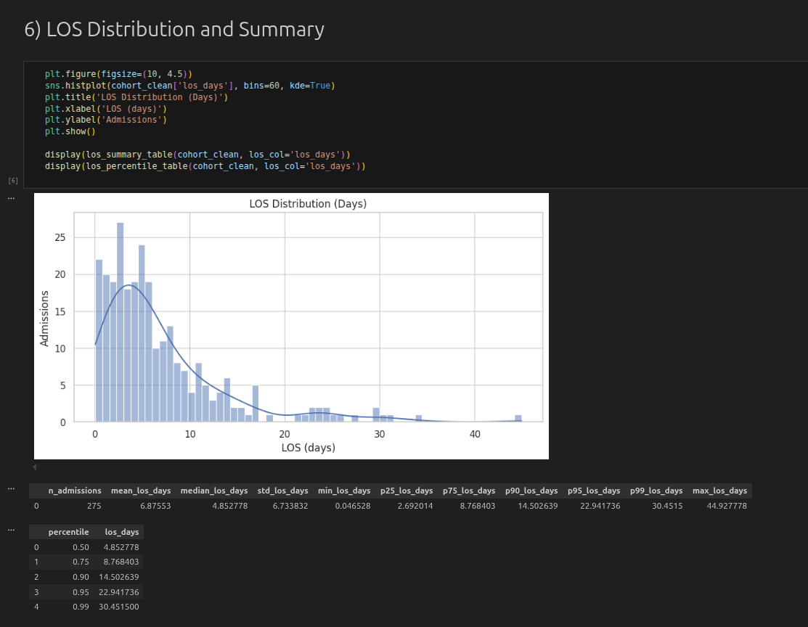
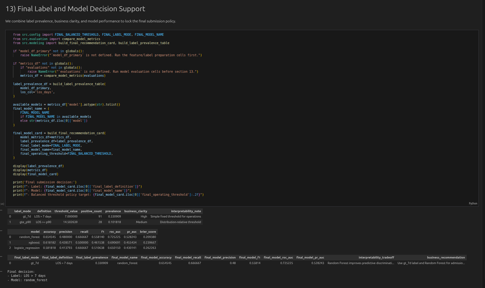
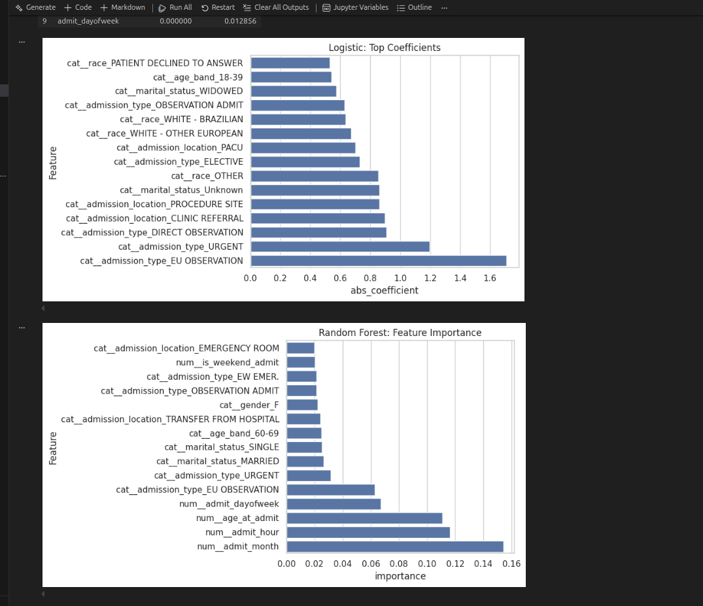
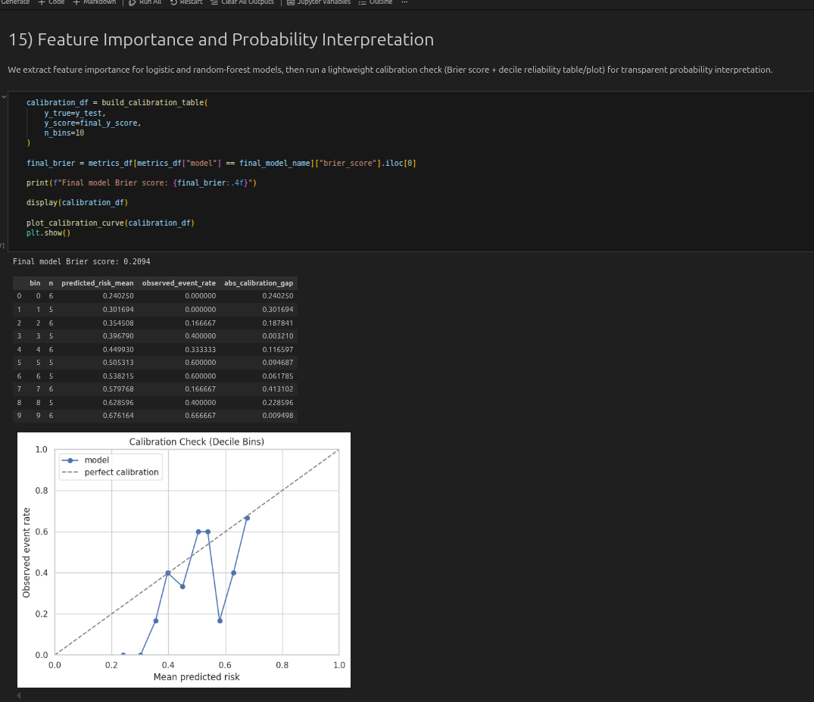
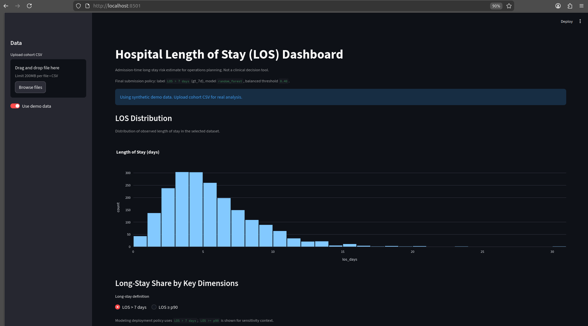

# Hospital Length of Stay (LOS) Case Study - MIMIC-IV

End-to-end healthcare analytics case study focused on early identification of likely long-stay admissions for hospital operations planning.

## Repo Overview
This repository delivers a full portfolio package:
- standalone SQL for cohort + LOS analytics
- modular Python pipeline for feature engineering and modeling
- story-driven notebook for analysis and interpretation
- Streamlit dashboard for operational review and risk scoring
- executive-style case summary

## Business Problem
Hospitals face bed-capacity pressure because a relatively small share of long-stay admissions consumes a large share of total bed-days.  
Goal: estimate long-stay risk at admission time so operations teams can start discharge planning and care coordination earlier.

## Dataset
- Target data design: **MIMIC-IV v3.1** (PhysioNet)
- Source link: https://physionet.org/content/mimiciv/3.1/
- Access requires PhysioNet credentialing and data-use compliance.
- Core tables used in this phase:
  - `admissions`
  - `patients`
- Current runnable local sample: **MIMIC-IV Demo 2.2** (workflow demonstration)

## Final Decisions
- Final long-stay label: **`LOS > 7 days`** (`gt_7d`)
- Final prediction model: **`random_forest`**
- Final balanced operating threshold: **`0.40`**
- Interpretability reference model: **`logistic_regression`**

## SQL Artifacts
The `/sql` folder contains standalone, review-ready SQL files:
- `01_build_inpatient_cohort.sql`: joins admissions/patients and filters to the analytic cohort with valid admit/discharge times.
- `02_los_summary_stats.sql`: computes LOS statistics, candidate label prevalence, and subgroup summaries.
- `03_long_stay_outliers.sql`: identifies and ranks longest-stay admissions for operational/data-quality review.

Mapping note for reviewers: these files correspond to the typical breakdown of cohort build -> LOS/label computation -> subgroup/outlier analysis.

## Method Summary
1. Build one-row-per-admission cohort (`hadm_id`) and compute LOS from `admittime`/`dischtime`.
2. Run data quality checks (missingness, dedup guard, LOS sanity).
3. Engineer admission-time-safe features and exclude leakage-prone fields.
4. Train baseline models (Logistic, Random Forest, optional XGBoost).
5. Evaluate with PR-AUC, ROC-AUC, recall, precision, F1, confusion matrix.
6. Tune threshold policy for operational use.
7. Save artifacts for dashboard inference and reporting.

## EDA Findings (Current Demo Cohort, n=275)
1. **Overall cohort -> prevalence + bed-day concentration -> operational implication:**  
   `LOS > 7 days` admissions were **33.09% (91/275)** of admissions but contributed **67.48%** of inpatient bed-days (**1275.89 / 1890.77**), showing long stays are the main driver of bed utilization.
2. **Admission location subgroup -> long-stay rate comparison -> operational implication:**  
   `TRANSFER FROM HOSPITAL` had a long-stay rate of **51.16%** versus **26.98%** for `PHYSICIAN REFERRAL`, indicating transferred patients were about **1.9x** more likely to cross the 7-day threshold in this cohort.
3. **Concentration subgroup -> admission share vs long-stay bed-day share -> operational implication:**  
   `TRANSFER FROM HOSPITAL` accounted for **15.64%** of admissions but **23.76%** of long-stay bed-days, suggesting a concentrated target for transition-of-care process improvement.
4. **Calendar subgroup -> weekend vs weekday LOS and long-stay rates -> operational implication:**  
   For `Fri-Sun` admissions, median LOS was **4.94** days vs **4.83** for `Mon-Thu`, and long-stay rate was **31.67%** vs **34.19%**; this demo cohort does **not** show a weekend-penalty signal.
5. **Scope note (service lines):**  
   A service-line column is not available in the current demo cohort, so subgroup evidence uses admission-type/location proxies. Service-line analysis is planned for the next data expansion.

## Dashboard User Story (Primary Persona)
A **care-management lead** can use the dashboard during morning huddles to review LOS distribution, check long-stay shares by admission context, and focus on the highest-risk admissions predicted by the model.  
Using the balanced threshold (`0.40`), the lead can quickly shortlist cases for early discharge-planning outreach before noon.  
This supports faster escalation and more consistent bed-flow coordination.

## Dashboard Run (Local)
Install and run:
```bash
pip install -r requirements.txt
streamlit run dashboard/app.py
```

What the app does:
- loads saved analytic/model artifacts when available,
- displays LOS distribution and subgroup long-stay views,
- provides single-admission risk scoring with plain-language risk tier output.

## Screenshots
Screenshots are stored in `assets/screenshots/`.

### 1) Notebook - LOS Distribution
  
Placement: EDA discussion immediately after LOS distribution findings.

### 2) Notebook - Final Label and Model Decision
  
Placement: model selection/decision section.

### 3) Notebook - Threshold Policy
  
Placement: threshold policy explanation (`0.40` balanced operating point).

### 4) Notebook - Feature Importance
  
Placement: explainability discussion.

### 5) Dashboard - LOS + Risk Prediction
  
Placement: dashboard user-story section.

Recommended additional screenshots for client EDA feedback:
1. Subgroup comparison table/plot from notebook section `7) Comparison of Long-Stay Definitions`
2. Cleaning summary outputs from notebook section `5) Data Cleaning Checks`

## How to Run Full Project
1. Setup:
```bash
cd /home/dell/projjLOS
python3 -m venv venv
source venv/bin/activate
pip install -r requirements.txt
```
2. Place required files:
```text
data/raw/mimiciv/hosp/
├── admissions.csv.gz
└── patients.csv.gz
```
3. Run notebook top-to-bottom:
- `notebooks/los_case_study.ipynb`
4. Launch dashboard:
```bash
streamlit run dashboard/app.py
```

## Next Steps
With additional time and data, this project would be extended in three directions:
1. **Scale and stability:** move from demo cohort to a larger/full inpatient dataset for more stable performance and subgroup estimates.
2. **Feature enrichment:** add clinical context such as diagnoses, labs, vitals, and comorbidity features to improve discrimination and interpretability.
3. **Production hardening:** add automated data-quality checks, model monitoring (including fairness checks), and tighter integration with admission/bed-management workflows.

## Project Verification Checklist
- Notebook completes through final packaging with no errors.
- Dashboard launches and shows distribution, subgroup view, and risk scoring.
- SQL files are present and readable under `/sql`.
- Artifacts exist:
  - `outputs/models/baseline_models.joblib`
  - `outputs/tables/model_metrics.csv`
  - `outputs/tables/threshold_tuning.csv`
  - `outputs/tables/final_model_card.csv`
- Final policy remains consistent:
  - Label: `LOS > 7 days`
  - Model: `random_forest`
  - Threshold: `0.40`

## Disclaimer
Educational/portfolio use with de-identified data only. Not for direct clinical decision-making.
